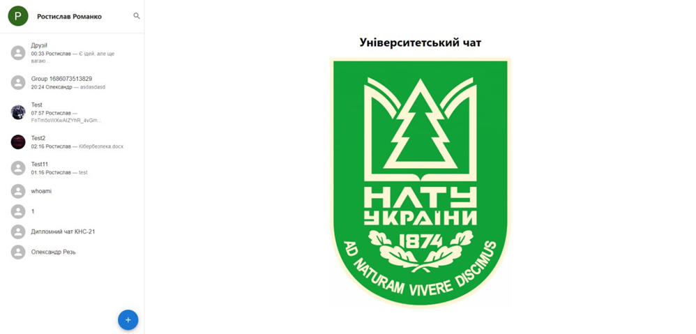
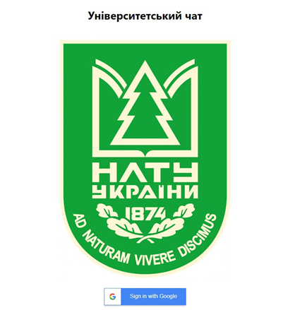
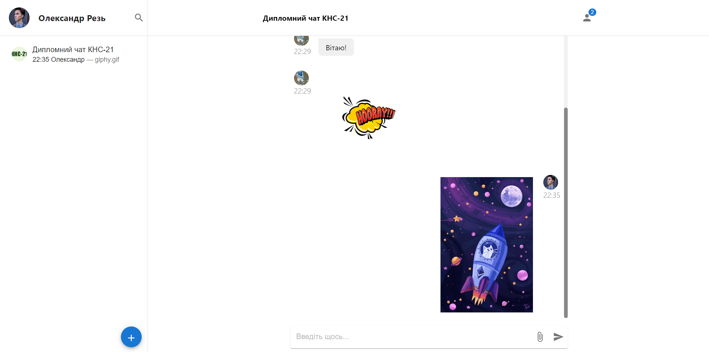

# Messenger diploma project

This web application was created as part of the diploma project for the Lviv National Forestry University. 
The main goal of this project was to create a messenger web application with basic messaging functionality
as well as number of features useful for the students of my university.


Backend and frontend parts of the application where created separately and communicate with each other via REST API.
For authorisation Google OAuth 2.0 is used.

## Frontend 

Frontend was created with React JS framework. This project marks my first experience using React.

#### Installation
```
# Navigate to the project frontend directory
cd frontend-react

# Install dependencies
npm install

# Start the development server
npm start
```

Provide `REACT_APP_BASE_BACKEND_URL`, `REACT_APP_GOOGLE_CLIENT_ID` values in `.env` file in the frontend directory 


## Backend 

Backend was created with Django framework. Default configuration uses SQLite database and "in-memory" storage for messages but this can be changed in the `settings.py` file.

#### Installation 
```
# Navigate to the project backend directory
cd backend-django

# Create virtual environment
python3 -m venv venv

# Activate virtual environment (for Linux)
source venv/bin/activate

# Activate virtual environment (for Windows)
venv/Scripts/activate

# Install dependencies
pip install -r requirements.txt

# Start the development server
python manage.py runserver
```

To have access to the admin site a superuser is needed. To create a superuser follow the instructions:

```
# Navigate to the project backend directory
cd backend-django

# Create superuser, fill in all required insformation
python manage.py createsuperuser
```

Enter the superuser username and password to log in to the Django admin site at backend root + `/admin`. Once logged in, you'll have access to the admin interface

## Technologies Used

#### Backend
- Python
- Django
- Django REST Api
- Django Channels
- SQLite

#### Frontend 
- HTML
- Tailwind CSS
- JavaScript
- React
- Material UI

## Demonstration

<p align="center">
  
  <p align="center">Picture 1. Home site</p>
</p>

<p align="center">
  
  <p align="center">Picture 2. Login site</p>
</p>

<p align="center">
  
  <p align="center">Picture 3. Messaging example</p>
</p>